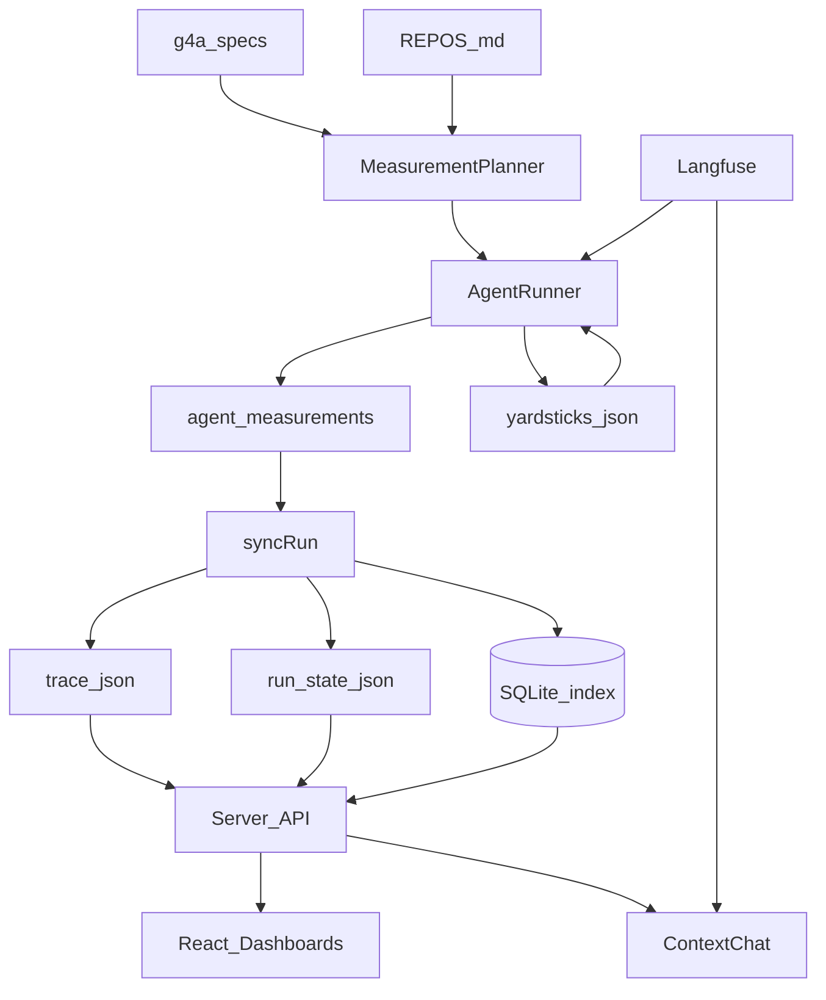

# Yardstick — Architecture

**Status:** living doc (v0.1)

## Monorepo layout

```text
apps/web/          Vite + React + Tailwind v4 — dashboards + context chat
apps/server/       Hono API — sync, runs, jobs, chat SSE
packages/core/     Schemas, sync, yardstick, baseline, scorecard model
packages/db/       SQLite migrations + queries
packages/llm/      Provider-agnostic LLM (Anthropic first, OpenAI stub)
packages/observability/  TraceProvider (Langfuse first)
```

Legacy folders remain as data inputs:

- `g4a-specs/`, `g4a-challenger-repos/`, `g4a-benchmarks/`
- `g4a-harness/` — Python prototype; hybrid agent bridge until TS port complete

## Data flow



## Phase map

| Phase | Deliverable |
|-------|-------------|
| 0 | Living docs |
| 1 | pnpm monorepo scaffold |
| 2 | Schemas, SQLite, LLM/obs interfaces |
| 3 | sync_run port + Vitest parity |
| 4 | Server API |
| 5 | Scorecard / compare / workbench UI |
| 6 | Floating context chat |
| 7 | Job queue + Python agent bridge |
| 8 | Baseline first-commit + yardstick auto-promote UI |

## Pivot triggers

| If… | Then reconsider… |
|-----|------------------|
| Sync parity tests fail often | Keep Python sync as subprocess temporarily |
| Langfuse adds too much friction locally | Default to noop TraceProvider, Langfuse opt-in |
| React scorecard diverges from prototype HTML | Use prototype render output as golden fixtures |
| Docker unavailable on dev machines | Add local subprocess sandbox mode |

## Doubts / revisit if

- Hono + Vite proxy vs single server serving static — may merge later for simpler deploy.
- SQLite may bottleneck concurrent agent jobs — acceptable for local v1.
